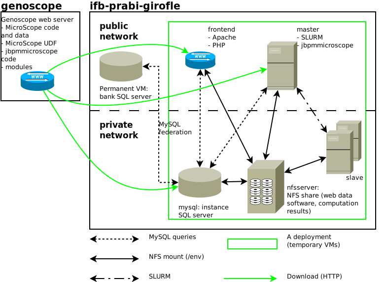

# biosphere-microcloud

## Introduction

This repository contains the recipes needed to deploy MicroScope on [IFB Biosphere](https://biosphere.france-bioinformatique.fr/).
SlipStream components clone this repository and execute scripts from it.

The application connects to a permanent VM (`umr5558-microcloud.univ-lyon1.fr`)
to create a MySQL federation (port 3306).
Therefore, it can only be deployed on `ifb-prabi-cloud` (where the permanent VM is accessible).

## Components & application

The project currently contains 5 components (see the corresponding folder for more details):

  - `nfsserver`: this is the NFS server which exposes storage to the network (under `/var/nfsshare`).
  - `mysql`: this is the MySQL server; it interacts with a permanent VM.
  - `master`: this is the head node for the cluster; it also runs `jbpmmicroscope`.
  - `slave`: cluster compute node.
  - `frontend`: this is the web server; the code is in `frontend` (see notes here); phpMyAdmin is installed on it.

The components are based on [IFB CentOS 7 image](https://nuv.la/module/ifb/examples/images/centos-7-ifb)
except `master` and `slave` which are based on [IFB Ubuntu 18.04 image](https://nuv.la/module/ifb/examples/images/ubuntu-18.04-ifb).
All components are on the private network except `master` and `frontend`.

The `MicroCloud` application instantiates and connects components (by default, it instantiates 2 `slave` components).

From a user point of view:

  - browsing, service demands, etc. are done on `frontend` through a web browser.
  - WF deployment, sequence integration, etc. are done on `master` (SSH connection).

## Technical notes

### VM naming convention

All names are `lowercase_underscore_separated` (except `nfsserver`).

### Input and output ports naming convention

All names are `lowercase_underscore_separated`.

Inputs and variables in script:

  - if an input is supposed to come from another component its name SHOULD begin with the name of the source component;
  for instance the input connected to the `hostname` output of the `mysql` component is `mysql_hostname`
  - if the value of a parameter is read in a variable, the name of the variable SHOULD be the same than the name of the input

Outputs:

  - the entry name SHOULD NOT start with the name of the component
  - each component SHOULD have a `is_ready` output which is set to `true` at the very end of the deployment script

Note that `master` and `slave` use different conventions (they were copied from IFB team).

## TODO

  - how are declared service URL from the `MicroCloud` application ?
